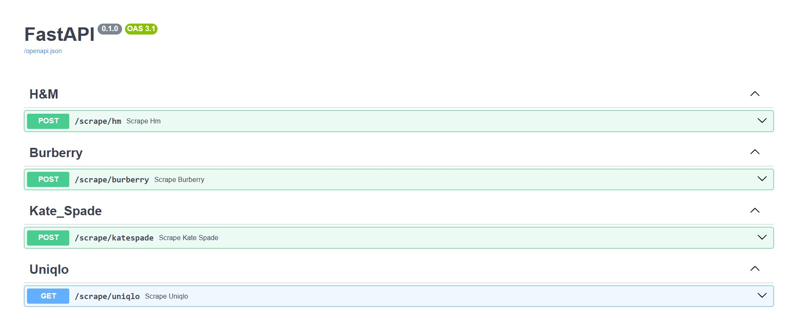

# Brand Product Scraper API

An API for scraping product information from various brands, including details, images, and videos.

## Supported Brands

- H&M
- Burberry 
- Kate Spade
- Uniqlo

## Project Structure

```
brand_products_scraper/
└── api/
    ├── main.py               # The entry point of the FastAPI application, initializing the app and routing
    ├── models.py             # Contains data models for API requests and responses using Pydantic
    ├── __init__.py           # Marks the api directory as a Python package for module imports
    └── endpoints/
        ├── burberry_scraper_api.py  # API endpoints for scraping product info from Burberry
        ├── hm_scraper_api.py        # API endpoints for scraping product info from H&M
        ├── kate_spade_api.py        # API endpoints for scraping product info from Kate Spade
        ├── uniqlo_scraper_api.py    # API endpoints for scraping product info from Uniqlo
        ├── zara_scraper_api.py      # API endpoints for scraping product info from Zara
        └── __init__.py              # Marks the endpoints directory as a Python package for imports
```

## Setting Up a Virtual Environment

To manage dependencies effectively, it's recommended to set up a virtual environment using either `venv` (built-in with Python) or `conda` (via Anaconda or Miniconda).

### Option 1: Using `venv`

1. **Create a Virtual Environment**
   ```bash
   python -m venv venv
   ```
   This creates a virtual environment named `venv` in your project directory.

2. **Activate the Virtual Environment**
   - **On Windows:**
     ```bash
     venv\Scripts\activate
     ```
   - **On macOS/Linux:**
     ```bash
     source venv/bin/activate
     ```

3. **Deactivate the Environment** (when you're done working)
   ```bash
   deactivate
   ```

### Option 2: Using `conda`

1. **Create a Conda Environment**
   ```bash
   conda create -n myenv python=3.8
   ```
   Replace `myenv` with your preferred environment name and `python=3.8` with the Python version you need.

2. **Activate the Conda Environment**
   ```bash
   conda activate myenv
   ```

3. **Deactivate the Environment**
   ```bash
   conda deactivate
   ```

## Installing Dependencies from `requirements.txt`

After setting up and activating your environment, install dependencies by running:

```bash
pip install -r requirements.txt
```

## Setup and Execution

Follow these steps to run the `main.py` file for your FastAPI project, access the endpoints, and utilize the interactive API documentation.

1. **Navigate to Your API Project Directory**
   Open your terminal and change to the directory containing your FastAPI project files:
   ```bash
   cd api/
   ```

2. **Run the `main.py` File**
   ```bash
   python main.py
   ```
   This will start the FastAPI server and output the following:
   ```
   INFO:     Started server process [9952]
   INFO:     Waiting for application startup.
   INFO:     Application startup complete.
   INFO:     Uvicorn running on http://127.0.0.1:8000 (Press CTRL+C to quit)
   ```

3. **Access the API**
   - In your browser, go to `http://127.0.0.1:8000` to see the running server.
   - To access the Swagger UI documentation, go to `http://127.0.0.1:8000/docs`.

   

You can now interact with the API and test the available endpoints using the Swagger UI.