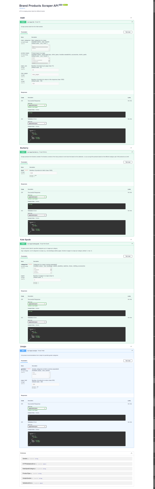

# Brand Product Scraper API Documentation

## Overview
A comprehensive API for scraping product information from major fashion brands. Get detailed product data including prices, images, colors, and availability.

## Supported Brands
- H&M
- Burberry
- Kate Spade
- Uniqlo
- Zara (Coming Soon)

## Getting Started

### Installation

1. **Set Up Virtual Environment**

   Using venv:
   ```bash
   python -m venv venv
   
   # Windows
   venv\Scripts\activate
   
   # macOS/Linux
   source venv/bin/activate
   ```

   OR using conda:
   ```bash
   conda create -n myenv python=3.8
   conda activate myenv
   ```

2. **Install Dependencies**
   ```bash
   pip install -r requirements.txt
   ```

3. **Start the Server**
   ```bash
   cd api/
   python main.py
   ```

   Server will run at: `http://127.0.0.1:8000`
   API Documentation: `http://127.0.0.1:8000/docs`


Check out Product API :



## API Endpoints

### 1. H&M Scraper (`POST /scrape/hm`)

Scrape products from H&M's catalog.

#### Parameters:
- `main_categories`: List of categories (`men`, `women`)
- `product_types`: List of types (`tshirts-tank-tops`, `shirts`, `jeans`, etc.)
- `page_size`: Products per page (max: 72)
- `max_pages`: Maximum pages to scrape
- `limit`: Maximum products to return (max: 1000)

#### Example Response:
```json
{
  "message": "Scraped 50 products for H&M",
  "products": [
    {
      "id": "12345",
      "product_name": "Slim Fit Jeans",
      "price": {"current_price": 29.99},
      "colors": ["Blue", "Black"],
      "images": ["image_url_1", "image_url_2"]
    }
  ]
}
```

### 2. Burberry Scraper (`POST /scrape/burberry`)

Scrape luxury products from Burberry.

#### Parameters:
- `limit`: Number of products (max: 1000)

#### Example Response:
```json
{
  "message": "Successfully scraped products from Burberry",
  "products": [
    {
      "id": "B12345",
      "title": "Check Cotton Shirt",
      "price": "$990",
      "alternatives": [
        {
          "label": "Archive Beige",
          "image": "image_url"
        }
      ]
    }
  ]
}
```

### 3. Kate Spade Scraper (`POST /scrape/katespade`)

Scrape products from Kate Spade's collection.

#### Parameters:
- `categories`: List of categories (`new`, `handbags`, `wallets`, etc.)
- `pages`: Pages to scrape per category (max: 5)

#### Example Response:
```json
{
  "message": "Scraping completed",
  "products": [
    {
      "name": "Spade Flower Jacquard Tote",
      "price": {
        "current_price": 298.00,
        "currency": "USD"
      },
      "color_variants": [
        {
          "color_name": "Blue",
          "images": ["image_url_1", "image_url_2"]
        }
      ]
    }
  ]
}
```

### 4. Uniqlo Scraper (`GET /scrape/uniqlo`)

Fetch product recommendations from Uniqlo.

#### Parameters:
- `genders`: List of categories (`men`, `women`)
- `page_limit`: Products per category (max: 500)

#### Example Response:
```json
{
  "message": "Data fetched successfully",
  "data": {
    "men": [
      {
        "name": "Product Name",
        "base_price": 29.99,
        "sizes": ["S", "M", "L"],
        "rating": 4.5
      }
    ]
  }
}
```

## Error Handling

Common error codes across all endpoints:
- `400`: Bad Request (Invalid parameters)
- `404`: Not Found (No products found)
- `500`: Internal Server Error
- `503`: Service Unavailable

## Rate Limiting
- Maximum 1000 products per request for most endpoints
- Uniqlo limited to 500 products per gender category
- Kate Spade limited to 5 pages per category

## Best Practices
1. Start with smaller limits for testing
2. Use appropriate categories for each brand
3. Handle rate limits and pagination appropriately
4. Implement error handling in your client code

## Note
The Zara scraper is currently under development and not available for use.